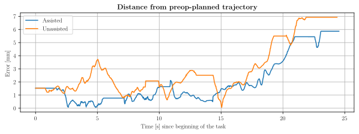

***
# Virtual Fixtures in Robot-Assisted Minimally Invasive Surgery
### *A study on their implementation, usability and effectiveness it the context of surgical robotics training*
A surgical training simulator integrated with the *daVinci* surgical system, employing Active Constraints/Virtual Fixtures that provide a haptic force feedback during the surgical task under the **assistance-as-needed** paradigm.

The project, conducted in the Medical Robotics section of [NearLab](https://nearlab.polimi.it/), is Alberto's Master thesis concluding the MSc in Biomedical Engineering at _Politecnico di Milano_.

* **Maintainer of the Project:** Alberto Rota
* **Supervisor:** Prof. De Momi Elena
* **Co-Supervisor:** Fan Ke

Want to partecipate to the experimental phase of this project? Read this [webpage](USER_STUDY.md) and then [contact the researchers](mailto:alberto2.rota@mail.polimi.it)
***
_As the project is still undergoing development, this README is very synthetic and above all **INCOMPLETE**. Additional information and details are available by [contacting the author](mailto:alberto2.rota@mail.polimi.it)_

_NOTE_: This repo currently only acts as a dev backup and a version control system for relevant files. **Downloading this repo will not download the simulator**, as larger files (blend, obj, packages, bin, ...) aren't stored here and will only be shared once the project is complete
***

# The project 
This work proposes a surgical simulator built in the Unity 3D environment where a virtual daVinci surgical robot is operated by a real teleoperation console. The user therefore sits at the console and manipulates the MTMs: looking at the oculars of the HRSV system, he/she will see the feed from two virtual cameras placed in the virtual 3D scene, acquiring depth perception as a consequence 

### Aim of the project
 The main goal of the work is to **implement and assess** the efficacy of **virtual fixtures**: from the relative position of the surgical tool tip and the one of objects, obstacles, trajectories or guides, a "guidance force" can be computed in such a way that its application to the surgical tooltip will improve the surgical performance. The **"Assistance-as-needed"** paradigm is the main factor that is taken into consideration when deciding weather or not (and how) to apply such force 

As an example, this force will be computed so that it pushes the end-effector away from obstacles or, conversely, towards trajectories.

#### Experimental Study
An experimental study will assess the effectiveness, utility and clinical relevance of Virtual Fixtures. In this phase, a population of volunteer subjects will be divided in:
* An **Assisted Group** (group **A**), where the haptic force feedback will be provided when performing surgical training tasks on the simulator
* A **Control Group** (group **C**), to whom no force feedback will be delivered  

The results of the study are anticipated as follows:
1. Subjects in **A** will learn surgical skills more rapidly than subjects in **C**
2. Subjects in **A** will reach an overall better performance than subjects in **C**, at the end of the study
3. Subjects in **A** will better skill retention 
4. Sbjects in **A** will show better skill transfer

|                                   |    Control Group    |  Assisted Group      |
|----------                         |:---:                |:------:              |
| Beginning of the training         |Poor performance     |Poor performance      |
| End of training                   |   Peak Performance  | Discrete Performance |
| After a period of no training     |   Good Performance  | Mediocre Performance |
| When presented with un-seen tasks |   Good Performance  | Poor Performance     |

## Framework
The trainee sits at the teleoperation console of a *daVinci* surgical robot and manipulates the MTMs

His motion will be replicated inside of the virtual surgical environment on virtual PSMs

In the virtual surgical scene, the relative position of the surgical tool and the anatomical structures will be used to compute the haptic feedback force

The force computed in the Unity environment is then, frame by frame, applied to the MTMs that the operator is holding as an **haptic force feedback**: transformations and changes in RFs are required. As a consequence, the user at the teleoperation console will feel an impediment or a guidance when performing the surgical tasks, allowing him/her to get optimally re-directed towards the desired pre-planned trajectory/workspace.

The image below is a very synthetic block diagram of the negative feedback for the haptic force

# The Surgical Tasks
8 Tasks are implemented by default on the simulator: 4 are surgical training tasks, while the others try to emulate a real surgical scenario.

This panel shows a preview of them.

These have been built with the purpose of requiring the trainee to sollecitate 4 main surgical abilities, in specifics:
* **Wrist dexterity:** The ability of achieving a wide range of complex orientations of the wrist
* **Steady hand:** The adherence and stabilization around trajectories/paths
* **Visual abstraction:** The capability of operating in areas where the surgical tool is not completely visible
* **Hand-to-hand cooperation:** The capacity of resolving tasks with both manipulators and the prowess is handing objects from one manipulator to another

# The Virtual Fixtures
An in-depth analysis of the scientific literature combined with further development in the view of optimizing this specific case of surgical training yielded the implementation of 6 types of Virtual Fixtures apt to grant guidance for all surgical abilities (as above *wrist dexterity*, *steady hand*, *visual abstraction* and *hand-to-hand cooperation*) and that can be deployed in each of the surgical task of the simulator. 

They have been formulated as follows:

* **Trajectory Guidance:** The feedback force will act in order to pull the tooltip towards a trajectory planned in the pre-op stage
* **Insetion Guidance:** The feedback force will keep the tooltip inside a "cone of approach" that is directed towards a target. This cone is set up in pre-op
* **Orientation Guidance**: A feedback torque will act in order to align the surgical tooltip in a specific orientation set up in pre-op
* **Obstacle Avoidance**: The feedback force will act in order to keep the surgical tool away from undesired areas
* **Surface Guidance:** Feedback force and torque are applied to keep the surgical instrument close to a surface (planar or non-planar) and with the same orientation as the surface itself
* **Trajectory and Orientation Guidance**: A combination of *Trajectory Guidance* and *Orientation Guidance*

# Preliminary Results
A sample video of a volunteer user with little experience in surgical training **WITHOUT ASSISTANCE**

***
The same subject performing the same task **WITH HAPTIC VIRTUAL FIXTURES APPLIED**

Following are the plots of the distance and angular errors (in *mm* and *degrees*, respectively) that the trainee issued while performing this suturing task. Position and orientation data are recorded in real time (30 frames per second) by the simulator and are saved as a `.csv` file ready for and extensive data analysis. 

**Even though this is preliminary data and no direct or indirect conclusion can be gathered**, it is still qualitatively evident how in general both the distance and angular error in the task performed with assistance (blue line) are lower than in the unassisted case (orange line)
