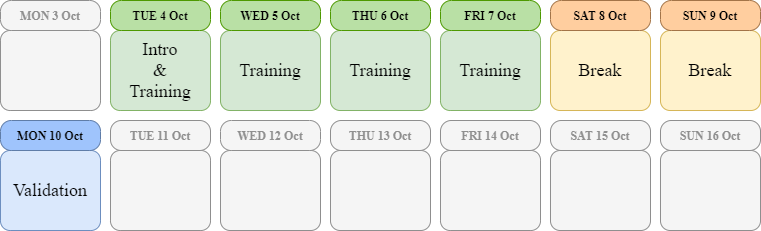

***
# EXPERIMENTAL PHASE RECRUITMENT
## Virtual Fixtures in Robot-Assisted Minimally Invasive Surgery
### *A study on their implementation, usability and effectiveness it the context of surgical robotics training*
A surgical training simulator integrated with the *daVinci* surgical system, employing Active Constraints/Virtual Fixtures that provide a haptic force feedback during the surgical task under the **assistance-as-needed** paradigm.

The project, conducted in the Medical Robotics section of [NearLab](https://nearlab.polimi.it/), is Alberto's Master thesis concluding the MSc in Biomedical Engineering at _Politecnico di Milano_.

* **Maintainer of the Project:** Alberto Rota
* **Supervisor:** Prof. De Momi Elena
* **Co-Supervisor:** Fan Ke

Additional detail about the project is available on this [webpage](README.md)

***
# Want to partecipate to the experimental phase of this project?
#### 📍**Where?**
**NearLab**, Building 7, Politecnico di Milano Leornardo campus ([here on the map](https://www.google.com/maps/place/Leonardo+Robotics+Labs,+Politecnico+di+Milano/@45.4776364,9.2293809,17.82z/data=!4m12!1m6!3m5!1s0x4786c7db599d5577:0xfd22cbc3f2315d09!2sNearlab+-+Neuroengineering+and+medical+robotics+laboratory!8m2!3d45.4721119!4d9.2272232!3m4!1s0x0:0x1b49fbc2f4773784!8m2!3d45.4781377!4d9.2294154))

#### 📅 **When?**
**From Tuesday 11th October to Monday 17th October** (Satuday 15th and Sunday 16th excluded), for a maximum of 30 minutes each day. 

The exact time on each day will be agreed in order to accommodate your availability and the availability of the other participants.

#### 🕑 **What do I have to do?**
You will be asked to manipulate a [*daVinci*](https://www.davincisurgery.com/) surgical robot from the surgeon console in a virtual environment. You'll see the virtual surgical scene in the viewers integrated into the console and you will need to perform simple movements (e.g. grasping, cutting, suturing) in a few repetitions for each day. 

You'll either be assigned to a "control" group or to an "assisted" group, at random: if you'll find yourself in the "assisted" group, you are going to recieve tactile assistance from the manipulator when performing the surgical tasks: the assistance will be provided as a force generated by the manipulator you are holding, and applied to your hand and wrist in order to guide you towards the surgical targets or away from surgical obstacles. Volunteers in the "control" group will not receive any assistance.

You will train on a few surgical tasks from Tuesday to Friday, and then you'll be asked to perform on different surgical tasks on Monday.

#### Agenda (not definitive)

#### **🎯What is the aim of the study?**
We hope to demonstrate that the users in the "assisted" group:
* Will reach peak performance faster than the users in the "control" group
* Will have a reduced performance drop after the weekend break (Skill Retention)
* Will have and increased performance on the tasks performed on Monday (Skill Transfer)

#### **🦺 Is it dangerous?**
Not at all. In the rare case that the forces applied to your wrist exceed the threshold of $3N$, the robot will automatically shut down and get unpowered.

#### **💰Do I get paid?**
Nope. But you will be included in the acknowledgements of my thesis and of the research paper we will write.

**However**, on Monday 17th October there will be a cake and some sweets for you to enjoy! 😃
